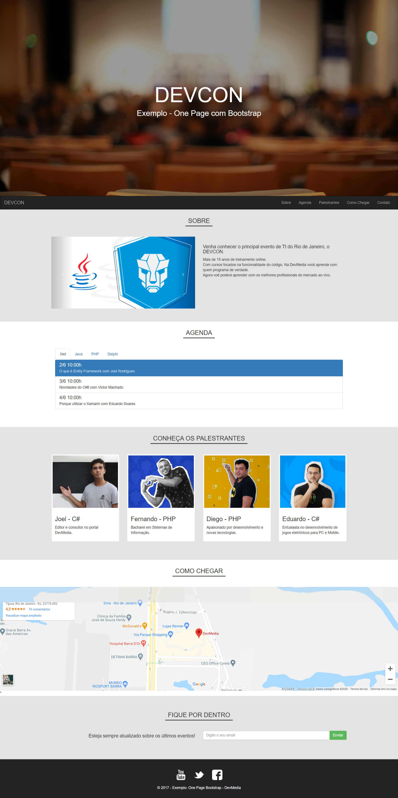

# Site DevMedia - Bootstrap

* 6º projeto, feito em HTML, CSS, JavaScript, Bootstrap e JQuery.
* Projeto desenvolvido no curso de Bootstrap da DevMedia.
* Site responsivo para todos os dispositivos.
* JQuery utilizado para fazer: Menu fixo em cima, Tooltip no footer e Interação com Google Maps API.